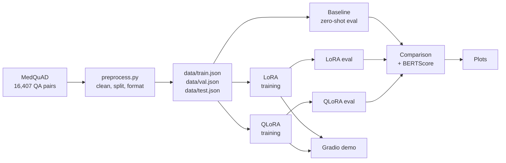
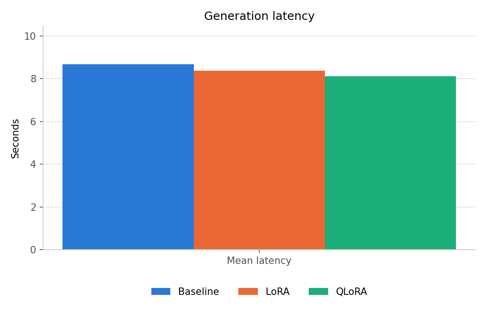
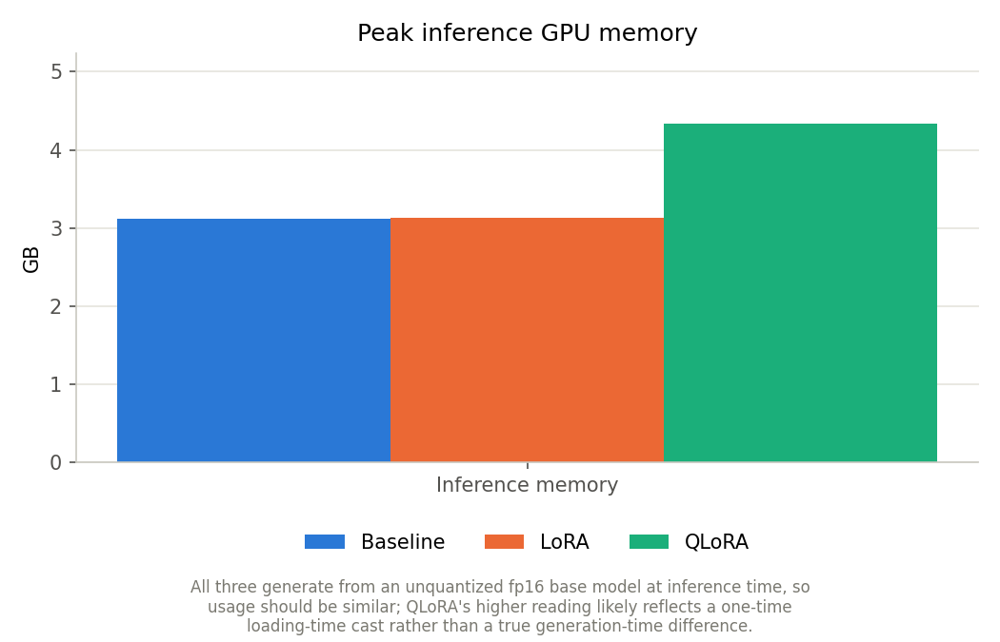

# PEFT-LLM: LoRA & QLoRA Fine-Tuning for Medical Q&A

Fine-tunes [Qwen2.5-1.5B-Instruct](https://huggingface.co/Qwen/Qwen2.5-1.5B-Instruct) on the [MedQuAD](https://huggingface.co/datasets/keivalya/MedQuad-MedicalQnADataset) medical question-answering dataset using **LoRA** and **QLoRA**, and compares both against the zero-shot base model on ROUGE, BERTScore, latency, and GPU memory. Training ran on free Kaggle T4 GPUs; everything else (preprocessing, evaluation aggregation, plotting, the demo) runs locally with no GPU required.

## Overview



## Architecture

```
PEFT/
├── configs/
│   ├── model.yaml          # base model, max sequence length
│   └── training.yaml       # LoRA hyperparameters (shared by LoRA and QLoRA)
├── src/
│   ├── data/preprocess.py  # load MedQuAD, clean, split, format, save
│   ├── training/
│   │   ├── train_lora.py   # SFTTrainer + LoraConfig
│   │   └── train_qlora.py  # SFTTrainer + LoraConfig + 4-bit BitsAndBytesConfig
│   └── evaluation/
│       ├── evaluate.py     # generation, ROUGE, BERTScore, comparison table
│       └── plots.py        # loss curve + comparison bar charts
├── notebooks/
│   ├── 01_preprocessing.ipynb  # local, no GPU
│   ├── 02_baseline.ipynb       # Kaggle GPU
│   ├── 03_lora.ipynb           # Kaggle GPU
│   ├── 04_qlora.ipynb          # Kaggle GPU
│   ├── 05_evaluation.ipynb     # local, no GPU
│   └── 06_results.ipynb        # local, no GPU
├── adapters/{lora,qlora}/  # trained adapter weights
├── results/
│   ├── {baseline,lora,qlora}.csv           # per-example predictions
│   ├── {baseline,lora,qlora}_summary.json  # aggregate metrics
│   ├── metrics/                            # per-epoch training history
│   ├── tables/comparison.csv               # combined cross-run table
│   └── plots/                              # generated charts
└── app/app.py              # Gradio demo (Base / LoRA / QLoRA)
```

Every notebook is a thin wrapper: install → import from `src/` → call one function. Training/generation logic lives in `src/`, not the notebooks.

## Dataset

[MedQuAD](https://huggingface.co/datasets/keivalya/MedQuad-MedicalQnADataset) — 16,407 medical question/answer pairs sourced from NIH health topic pages, covering diseases, symptoms, treatments, and diagnosis.

`src/data/preprocess.py` pulls it directly from the HF Hub, strips whitespace, drops empty/duplicate pairs, formats each example as an instruction/output pair, and splits 80/10/10 (seed 42):

| Split | Examples |
|---|---|
| Train | 13,089 |
| Validation | 1,635 |
| Test | 1,635 |

## Training

Both LoRA and QLoRA use identical hyperparameters (`configs/training.yaml`) — quantization is the only variable that differs between them, for a clean comparison:

| Hyperparameter | Value |
|---|---|
| LoRA rank / alpha / dropout | 16 / 32 / 0.05 |
| Target modules | `q_proj`, `k_proj`, `v_proj`, `o_proj` |
| Epochs | 3 |
| Batch size (effective) | 4 × 4 grad-accum = 16 |
| Learning rate | 2e-4 |

QLoRA additionally quantizes the frozen base model to 4-bit (NF4, double quantization, fp16 compute dtype) via `bitsandbytes`.

Both trained on a single Kaggle T4 GPU (~3 hours each).

## Evaluation

`src/evaluation/evaluate.py` generates greedy (non-sampled) completions for a fixed, seeded 200-example sample of the test set — the same sample across baseline/LoRA/QLoRA, so results are directly comparable — and scores them with ROUGE and BERTScore against the reference answers, alongside mean generation latency and peak GPU memory.

## Results

| Model | ROUGE-1 | ROUGE-2 | ROUGE-L | BERTScore F1 | Latency | Train time |
|---|---|---|---|---|---|---|
| Baseline (zero-shot) | 0.279 | 0.063 | 0.148 | 0.838 | 8.67s | — |
| LoRA | **0.390** | **0.225** | **0.299** | **0.878** | 8.36s | 3h29m |
| QLoRA | 0.371 | 0.189 | 0.269 | 0.872 | 8.11s | 3h03m |

Both fine-tuning methods clearly beat the zero-shot baseline. LoRA edges out QLoRA slightly on every quality metric — the expected small trade-off from 4-bit quantization noise in the frozen base weights — while QLoRA trains a bit faster.






QLoRA's actual memory advantage shows up in **training**, not inference: peak training GPU memory was 7.47GB (LoRA's equivalent number wasn't captured — that instrumentation was added after the LoRA run completed).

## Demo

`app/app.py` is a Gradio app that loads the base model once and hot-swaps between Base / LoRA / QLoRA via PEFT's multi-adapter support (no reload per request):

```bash
python app/app.py
```

Then open `http://localhost:7860`, pick a model, ask a medical question, and see the answer plus generation latency. Auto-detects CUDA / Apple Silicon (MPS) / CPU.

## Setup

```bash
python3 -m venv .venv
source .venv/bin/activate
pip install -r requirements.txt
```

Preprocessing, evaluation aggregation, plotting, and the demo all run locally. Training and the baseline/adapter evaluation notebooks need a GPU — they were run on Kaggle's free T4 instances; each Kaggle notebook clones this repo and reinstalls its own dependencies, so a local venv isn't required for those.

## Reproduce

1. `notebooks/01_preprocessing.ipynb` — verify the dataset pipeline (local)
2. `notebooks/02_baseline.ipynb` — zero-shot baseline (Kaggle GPU)
3. `notebooks/03_lora.ipynb` — train + evaluate LoRA (Kaggle GPU)
4. `notebooks/04_qlora.ipynb` — train + evaluate QLoRA (Kaggle GPU)
5. `notebooks/05_evaluation.ipynb` — combined comparison table + BERTScore (local)
6. `notebooks/06_results.ipynb` — generate charts (local)
