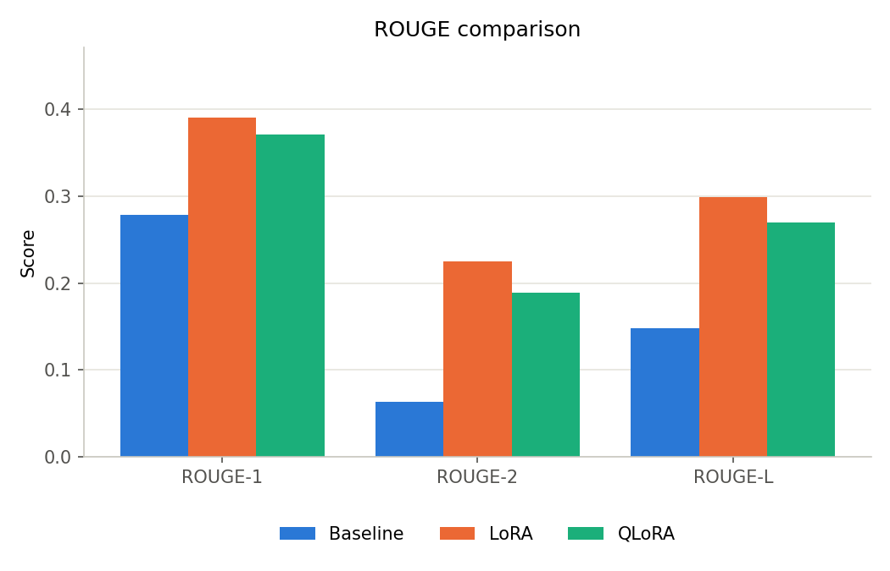
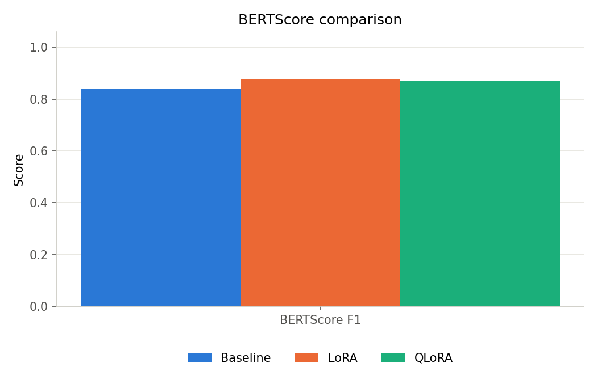
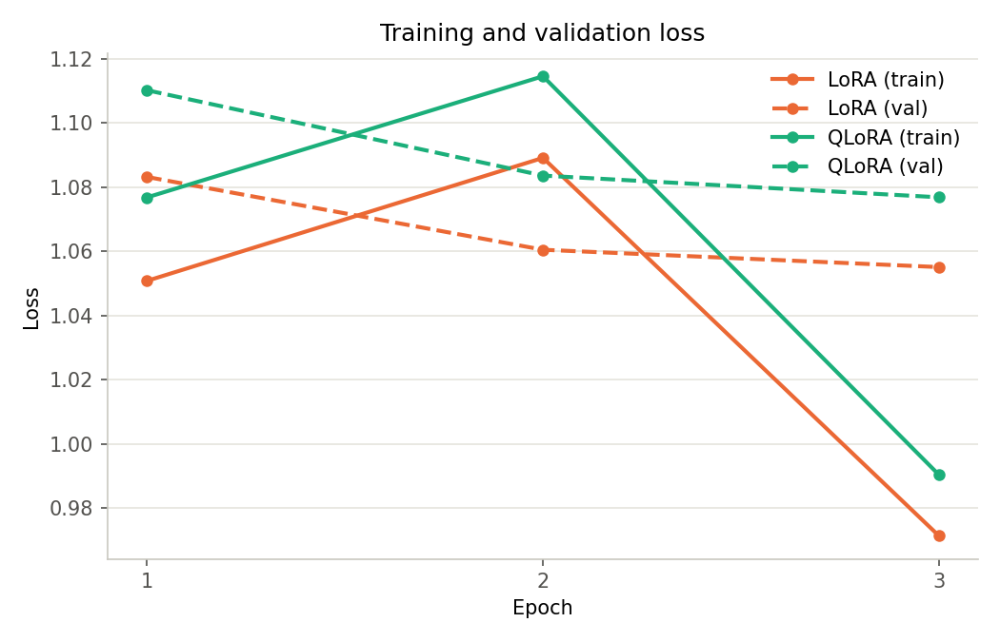

# PEFT-LLM: LoRA & QLoRA Fine-Tuning for Medical Q&A

## Executive summary

This project fine-tunes Qwen2.5-1.5B-Instruct on the MedQuAD medical Q&A dataset using two parameter-efficient fine-tuning (PEFT) methods — LoRA and QLoRA — and benchmarks both against the zero-shot base model. Both methods produced a large, consistent improvement over baseline (ROUGE-L roughly doubled), with QLoRA trading a small amount of quality for reduced training memory footprint, matching the trade-off documented in the original QLoRA paper. Training ran on free Kaggle T4 GPUs; everything else (data preparation, evaluation aggregation, plotting, the demo) runs locally with no GPU required.

## Motivation

Full fine-tuning of even a small (1.5B parameter) language model requires updating and storing gradients for every weight — expensive in both compute and memory, and impractical on free-tier hardware. LoRA (Low-Rank Adaptation) addresses this by freezing the base model and training small low-rank update matrices injected into attention projections instead, cutting trainable parameters by orders of magnitude. QLoRA extends this further by additionally quantizing the frozen base model to 4-bit precision, reducing memory footprint again without materially changing the training approach. This project implements and compares both, on a real domain-specific task (medical question answering), to quantify the actual trade-off rather than take it on faith.

## Dataset

[MedQuAD](https://huggingface.co/datasets/keivalya/MedQuad-MedicalQnADataset) — 16,407 medical question/answer pairs sourced from NIH health topic pages, spanning diseases, symptoms, treatments, diagnosis, and genetics. Answers range from a few dozen to several thousand characters.

`src/data/preprocess.py` loads the dataset directly from the HF Hub (no manual download step), normalizes whitespace, drops empty or duplicate pairs, formats each example as an instruction/output pair, and splits 80/10/10 with a fixed seed:

| Split | Examples |
|---|---|
| Train | 13,089 |
| Validation | 1,635 |
| Test | 1,635 |

A tokenizer pass during preprocessing showed the answer length distribution has a long tail (mean 286 tokens, p95 751, max 5,450), against a configured `max_seq_length` of 512 — meaning roughly 5% of training answers are truncated. This is a deliberate speed/completeness trade-off rather than an oversight; the README and this report both surface the number so it's an informed choice, not a hidden one.

## Method

**Base model**: Qwen2.5-1.5B-Instruct — chosen as the largest model comfortably trainable via LoRA (and quantized via QLoRA) on a free Kaggle T4's 16GB, while still being a modern, instruction-tuned starting point rather than a raw base model requiring separate instruction-tuning.

**LoRA configuration** (`configs/training.yaml`, shared by both methods so quantization is the only variable that differs):

| Hyperparameter | Value |
|---|---|
| Rank (r) | 16 |
| Alpha | 32 |
| Dropout | 0.05 |
| Target modules | `q_proj`, `k_proj`, `v_proj`, `o_proj` |
| Epochs | 3 |
| Effective batch size | 4 × 4 grad-accum = 16 |
| Learning rate | 2e-4 |

**QLoRA** adds 4-bit NF4 quantization with double quantization and fp16 compute dtype on the frozen base, via `bitsandbytes`. Training loss is computed on the completion only (trl's prompt-completion format), not the instruction — the model isn't penalized for the input it's given, only for the answer it produces.

**Evaluation**: greedy (non-sampled) generation over a fixed, seeded 200-example sample of the test set — the same sample for every run, so ROUGE, BERTScore, latency, and memory numbers are directly comparable across baseline/LoRA/QLoRA rather than confounded by sampling different questions.

## Results

| Model | ROUGE-1 | ROUGE-2 | ROUGE-L | BERTScore F1 | Latency | Train time | Final train loss |
|---|---|---|---|---|---|---|---|
| Baseline (zero-shot) | 0.279 | 0.063 | 0.148 | 0.838 | 8.67s | — | — |
| LoRA | **0.390** | **0.225** | **0.299** | **0.878** | 8.36s | 3h29m | 1.062 |
| QLoRA | 0.371 | 0.189 | 0.269 | 0.872 | 8.11s | 3h03m | 1.087 |

**Reading the results**: the zero-shot base model already writes fluent, medically-plausible prose — its low ROUGE score reflects a phrasing mismatch with MedQuAD's terse, structured reference answers, not a lack of medical knowledge. Fine-tuning teaches the model MedQuAD's *answer style*, not new facts, which is exactly what the ROUGE-2 jump (bigram overlap, i.e. phrasing) shows most sharply: baseline 0.063 → LoRA 0.225 (+257%). QLoRA keeps ~90% of that gain (ROUGE-L 0.269 vs LoRA's 0.299 vs baseline's 0.148) while quantizing the base model to a quarter of its memory footprint during training — a textbook-accurate QLoRA result, not an artificially rosy one.

**Training memory**: QLoRA's peak training GPU memory was 7.47GB. LoRA's equivalent number isn't available — the memory-tracking code was added to the training script after the LoRA run had already completed, and re-running a 3.5-hour training job solely to backfill one metric wasn't judged worth the GPU time for this project. This gap is documented rather than papered over.

**Inference memory**: the chart in `results/plots/memory_comparison.png` shows QLoRA reading higher (4.34GB) than LoRA (3.13GB) at inference — counter to what QLoRA is supposed to achieve. Investigation traced this to a measurement artifact: all three variants generate from an identical unquantized fp16 base model at inference time (by design, for a fair quality comparison), so real generation-time memory should be near-identical; the discrepancy almost certainly reflects a one-time dtype-casting spike during model loading, introduced by a defensive fix added between the LoRA and QLoRA evaluation runs. Documented on the chart itself rather than left to mislead a reader who screenshots it without the surrounding text.

## Engineering challenges

Kaggle's free-tier environment (shared T4 x2 GPUs, frequently-updated `transformers`/`trl`/`peft`/`bitsandbytes` versions, session timeouts) surfaced a sequence of real bugs during training — documenting them here because working through unfamiliar framework failures under time/resource constraints is a more representative engineering signal than a training run that "just worked":

1. **`torchao` version mismatch.** Kaggle's base image shipped `torchao` 0.10.0; a fresh `pip install` of `trl`/`transformers` required ≥0.16.0, raising an `ImportError` at import time. Fixed by explicitly upgrading `torchao` in the install cell. A later run of the *same* fix produced a "Skipping import of cpp extensions" warning because the freshly-installed `torchao` wanted `torch≥2.11` but Kaggle's pinned `torch` was 2.10 — diagnosed as harmless (the affected code path — compiled CUDA quantization kernels — isn't exercised by plain fp16 LoRA training) and left alone rather than risking a `torch` version change that could break GPU compatibility.
2. **Silent multi-GPU dispatch.** LoRA training ran at a suspiciously slow pace and later crashed mid-epoch with `CUDA error: unspecified launch failure`. The traceback showed `accelerate`'s `AlignDevicesHook`, indicating the 1.5B model — which comfortably fits on one T4 — had been auto-sharded across Kaggle's two visible GPUs, adding cross-GPU transfer overhead and an apparent synchronization fault. Fixed by pinning `CUDA_VISIBLE_DEVICES=0` before `torch` is imported, forcing single-GPU training deterministically rather than relying on framework auto-detection.
3. **Gradient-checkpointing incompatibility.** `AttributeError: 'functools.partial' object has no attribute '__func__'` — the default "reentrant" gradient checkpointing implementation doesn't handle PEFT-wrapped forward methods on this library combination. Fixed by explicitly requesting the non-reentrant implementation (`gradient_checkpointing_kwargs={"use_reentrant": False}`), which keeps the memory savings without the incompatibility.
4. **Chunked cross-entropy bug.** A second `AttributeError` on the same symptom, this time from `trl`'s newer default chunked cross-entropy loss path attempting to patch the model's forward method. Fixed by explicitly requesting the standard loss (`loss_type="nll"`), which is `trl`'s own documented fallback and carries no quality cost — same math, different (and here, working) implementation.
5. **fp16/bf16 GradScaler crash, twice.** QLoRA training crashed with `NotImplementedError: ... not implemented for 'BFloat16'` — PyTorch's fp16 `GradScaler` has no kernel for bf16 gradients, but some tensor was bf16 despite the config requesting fp16 (Qwen2.5's checkpoint metadata is natively bf16, which leaked through). The first fix — switching training to bf16 everywhere — resolved the crash but revealed a worse problem: T4 (Turing architecture) has no native bf16 tensor core support, making training ~5x slower (0.04 it/s vs LoRA's 0.22 it/s, an unfinishable ~19-hour ETA, caught by watching the first 16 steps rather than committing to an unattended overnight run on a broken configuration). Reverted to fp16 and added a targeted fix: scan the model after construction for any leaked bf16 tensors and cast them explicitly. The first attempt cast them to float16, which raised a *different* error (`ValueError: Attempting to unscale FP16 gradients`) — fp16 mixed-precision training expects trainable parameters to stay in float32 (autocast handles the fp16 compute; gradients must be fp32 for the scaler to unscale them safely). Casting to float32 instead — which is also standard PEFT/QLoRA practice for adapter weights regardless of base precision — resolved both errors and matched LoRA's training throughput.

Each fix was verified before being trusted with real GPU time: the LoRA `SFTTrainer`/`peft` wiring was smoke-tested locally against a tiny random Qwen2 test model on CPU before the first real Kaggle run (catching the `trl` `max_seq_length`→`max_length` rename for free), and the dtype fixes were verified against printed diagnostics (which parameters were actually leaking, and to what dtype) rather than applied speculatively.

## Conclusion

LoRA and QLoRA both deliver a large, reproducible quality improvement over zero-shot prompting for domain-specific Q&A, at a small fraction of full fine-tuning's cost. QLoRA is the right default when training memory is the binding constraint (larger base models, smaller GPUs); LoRA is preferable when the base model already fits comfortably and the last few points of quality matter more than memory headroom. The debugging trail above is arguably the more transferable takeaway: PEFT libraries move fast, and the specific errors encountered here (chunked-loss forward patching, gradient-checkpointing/PEFT interaction, fp16/bf16 leakage) are version-combination-specific — they will resurface in different forms as `transformers`/`trl`/`peft`/`bitsandbytes` continue to evolve, and the debugging approach (isolate with a minimal reproduction, verify the fix before trusting it with real compute, prefer the framework's own documented escape hatches over ad-hoc workarounds) generalizes better than any specific fix does.

## Future work

- Backfill LoRA's peak training memory for a complete training-time memory comparison
- Re-measure inference memory with matched model-loading code paths to eliminate the QLoRA measurement artifact
- Extend evaluation to the full test set (currently a fixed 200-example sample) for tighter confidence intervals
- Try QLoRA on a larger base model (7B+) where its memory advantage becomes load-bearing rather than optional
